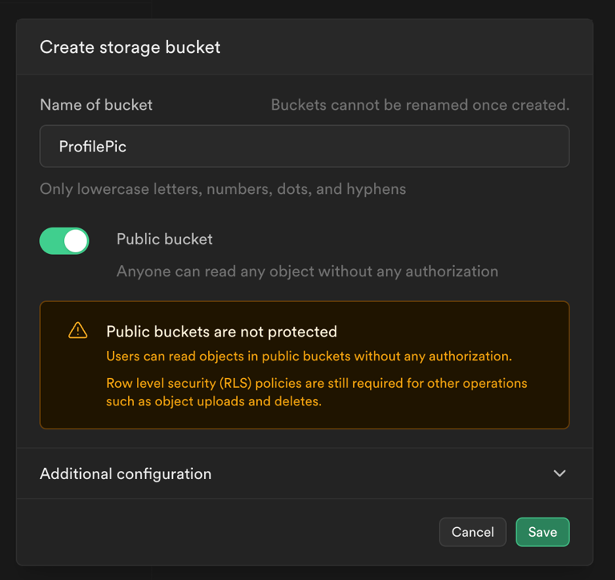

# Uploading Files

Uploading files is an essential feature for many apps, enabling users to share images, videos, documents, and more. FlutterFlow offers flexible actions to handle file uploads, whether you’re using Firebase, Supabase, or your own backend server. You can customize the upload process to suit your app’s needs, such as resizing media, setting quality, or temporarily storing files locally before uploading.

This guide covers the available upload methods, configuration options, and workflows, including how to save media locally and upload it via an API.

## Types of Media Uploads

FlutterFlow provides three methods for uploading media files, each catering to different needs:

### Firebase

Media files can be uploaded directly to **Firebase Storage**, a reliable cloud-based solution. Once the upload is complete, you can use the **Widget State > Uploaded File URL** to preview the media or store the file URL for later use.

### Supabase

You can upload media to a **Supabase bucket** at a specified location. After the upload, the file's URL is accessible via **Widget State > Uploaded File URL**, enabling you to preview the media or save the URL for later use in your app.

### Local Upload (Widget State)

This method initially stores your media on the device, making it accessible via **Widget State > Uploaded Local File**. You can preview, edit, or process the file before uploading it to a permanent storage.

## Upload or Save Media [Action]

This action allows you to upload a photo or video to your app. You can choose to store the file on [Firebase](#firebase), [Supabase](#supabase) storage, or your own server using an API. Once uploaded, you can access the file through its generated URL. This URL can be used to display the content immediately or store it in a database for future retrieval.

:::info[Prerequisites for Firebase]
1. **Firebase** should be connected to your project. Follow the instructions on [**this page**](../../ff-integrations/database/cloud-firestore/getting-started.md) for integrating Firebase with FlutterFlow.
2. **Firebase Authentication** must be properly configured. Check out [**this page**](../../ff-integrations/authentication/firebase-auth/auth-initial-setup.md) for setting up authentication.
3. **Firebase Storage** must be set up and properly configured. It takes just a second! Follow the instructions on [**this page**](../../ff-integrations/storage/firebase-storage/storage-rules.md).
4. At least one **Firebase Collection** should be configured for the project so that you can store the generated URL.
:::

:::info[Prerequisites for Supabase]
1. Make sure to [**integrate Supabase**](../../ff-integrations/supabase/supabase-setup.md) into your app.
2. [**Create a storage bucket**](https://supabase.com/docs/guides/storage/quickstart#create-a-bucket) in Supabase. By default, the **Public bucket** option is disabled, meaning uploaded media is not accessible by anyone without authentication. If needed, you can enable the Public bucket option, but this is not recommended for sensitive content.

3. Apply additional [**security rules**](https://supabase.com/docs/guides/storage/quickstart#add-security-rules) which determine who can access the bucket. **Tip**: If you are uploading to a folder structure like this '*pics/uploads*,' here is how you can add a policy that allows only authenticated users to upload their profile picture.

<iframe src="https://www.loom.
com/embed/963ac14f47de43a6b1d77ec1fd2b7228?sid=bced0a6b-4d0c-4b56-9886-5845319b2f9e" frameborder="0" allow="accelerometer; autoplay; clipboard-write; encrypted-media; gyroscope; picture-in-picture; web-share" referrerpolicy="strict-origin-when-cross-origin" allowfullscreen></iframe>

:::

To create an upload media workflow, add the **Upload/Save Media** action to the widget (e.g., a button or any interactive element) where you want users to initiate the file upload. Next, set the [**Upload Type**](#types-of-media-uploads). In the **Media Type/Source** section, specify the type of media to upload: photo, video, or both. Then, use the **Media Source** dropdown to choose the source of the media:

- **Camera**: Directly capture media using the device's camera.
- **Gallery**: Select existing media from the device's gallery.
- **Either Camera or Gallery**: Allows users to choose the source via a bottom sheet, letting them select either the camera or the gallery as the media source.

Once the media is uploaded, see how to display it on a widget in the [next section](displaying-media.md).

:::info

When you set **Upload Type** to:

- **Firebase**: You must [**deploy the storage rules**](../../ff-integrations/storage/firebase-storage/storage-rules.md).
- **Supabase**: Provide the **Bucket Name** and set the **Uploaded Folder Path** (e.g., pics/uploaded). This is the path where the media will be uploaded.

:::

    <iframe 
        src="https://demo.arcade.software/Pu6LihtPxFTaT5tI3srn?embed&show_copy_link=true"
        title=""
        style={{
            position: 'absolute',
            top: 0,
            left: 0,
            width: '100%',
            height: '100%',
            colorScheme: 'light'
        }}
        frameborder="0"
        loading="lazy"
        webkitAllowFullScreen
        mozAllowFullScreen
        allowFullScreen
        allow="clipboard-write">
    </iframe>

The Upload Media action offers various settings to control how media files are uploaded, resized, and processed in your app. Below is a breakdown of all the available properties.

- **Max Width** and **Max Height**: If you are uploading a photo, you can set a maximum width and height using these properties. This resizes the image while maintaining its original aspect ratio.
- **Image Quality**: Control the image quality by adjusting the slider or entering a value between 0 and 100, where 100 retains the original quality.
- **Include Media Dimensions**: Enable this option to retrieve the dimensions (width and height) of the uploaded media. Keep in mind that this operation is resource-intensive, so enable it only if necessary.
- **Include Blur Hash**: Automatically generates a BlurHash for the uploaded image, allowing you to display a blurred placeholder while the full image loads. For more information, refer to the [BlurHash](displaying-media.md#blurhash) section.
- **Source Picker Style**: Customize the appearance of the bottom sheet UI that appears when selecting a media source (e.g., Camera or Gallery).
- **Allow Multiple Images**: Enable this option to allow users to select multiple images. Note that this requires the **Media Source** to be set to **Gallery**. Once multiple images are uploaded, you can access their URLs via **Set from Variable menu > Widget State > Uploaded File URLs (`List<String>`)**.
- **Show Snackbar**: Enable this option to notify users about the upload progress with a snackbar message.

Check out our YouTube video for a detailed explanation of the **Upload or Save Media [Action]** in FlutterFlow.

    <iframe 
        src="https://www.youtube.com/embed/cKDuIZNdbh8"
        title=""
        style={{
            position: 'absolute',
            top: 0,
            left: 0,
            width: '100%',
            height: '100%',
            colorScheme: 'light'
        }}
        frameborder="0"
        loading="lazy"
        webkitAllowFullScreen
        mozAllowFullScreen
        allowFullScreen
        allow="clipboard-write">
    </iframe>

### Store Media for Upload

You can also save the media file temporarily on the device before uploading it to cloud storage by setting the **Upload Type** to [**Local Upload**](#local-upload-widget-state). This saves the file in Bytes, allowing you to preview, edit, or process it before finalizing the upload.

Once the file is uploaded to the device, you can do various things with it:

- **Preview or Validate the Media**: Show the user an in-app preview before deciding whether to finalize or discard the upload.

- **Editing Before Submission**: In social media apps, users upload photos for posts or stories. The app temporarily saves the image on the device while users edit or apply filters, and then uploads the final image to cloud storage. 
- **Perform Data Operations**: In document scanning apps, users capture images of documents, which are temporarily stored on the device. The app accesses the file bytes to apply OCR (Optical Character Recognition), enhance contrast, or convert the image to PDF before uploading the final processed file to cloud storage.
- **Offline Functionality**: Store the media locally and defer uploading until the user regains internet access.
- **Upload to Server**: When you want to store the file externally, you can then make an API call (e.g., multipart form data) to transfer the local file. Be sure to retrieve and save the resulting file URL if you plan to display it later.

Here are some examples of uploading a file to a device and using it in different scenarios:

**Example 1: Upload to Your Backend Server via API**

First, set the **Upload/Save Media** action with the **Local Upload (Widget State)** upload type. Then, add the next action as an **API call** and select the API that will upload the file to your server. After the API call is complete, ensure your server returns the uploaded file's URL. Use this URL to save in the database or [display the uploaded image](displaying-media.md).

:::info
The request body for the API must be in *Multipart* format. See how to [**configure an API for the multipart request body**](../../resources/control-flow/backend-logic/api/rest-api.md#multipart-format).
:::

    <iframe 
        src="https://demo.arcade.software/aGtMNp5Gz0H9PuncokfT?embed&show_copy_link=true"
        title=""
        style={{
            position: 'absolute',
            top: 0,
            left: 0,
            width: '100%',
            height: '100%',
            colorScheme: 'light'
        }}
        frameborder="0"
        loading="lazy"
        webkitAllowFullScreen
        mozAllowFullScreen
        allowFullScreen
        allow="clipboard-write">
    </iframe>

**Example 2: Compress Image Using Custom Action**

First, configure the **Upload/Save Media** action with the **Local Upload (Widget State)** upload type. This temporarily saves the media file on the device.

Next, create and add a [**Custom Action**](../../ff-concepts/adding-customization/custom-actions.md) (e.g., `compressImageAction`) that takes the locally stored file as input and compresses it using its **bytes** data. Ensure the custom action processes the image and returns a compressed file. Once compressed, the file can then be uploaded to cloud storage using another **Upload/Save Media** action.

**Example 3: Upload to Firebase or Supabase**

First, configure the **Upload/Save Media** action with the **Local Upload (Widget State)** upload type. Once the file is modified or processed, add another **Upload/Save Media** action to the widget that confirms the final upload. Set the **Upload Type** to **Firebase** or **Supabase**, choose **File Type** as the **Uploaded File**, and select **File to Upload** from **Widget State > Uploaded Local File**.

## Upload or Save File [Action]

You can upload any type of file to your app, such as PDFs, MP3s, and more. The process for uploading files is almost similar to the [Upload or Save Media Action](#upload-or-save-media-action).

:::info[Web access for PDF files]

If you plan to support the web version of your app or test the PDF upload feature in **Run Mode**, you’ll need to complete additional configuration steps required for certain file types (e.g., PDFs). Learn how to [**enable web access**](displaying-media.md#web-access-for-pdfs-and-other-files).

:::