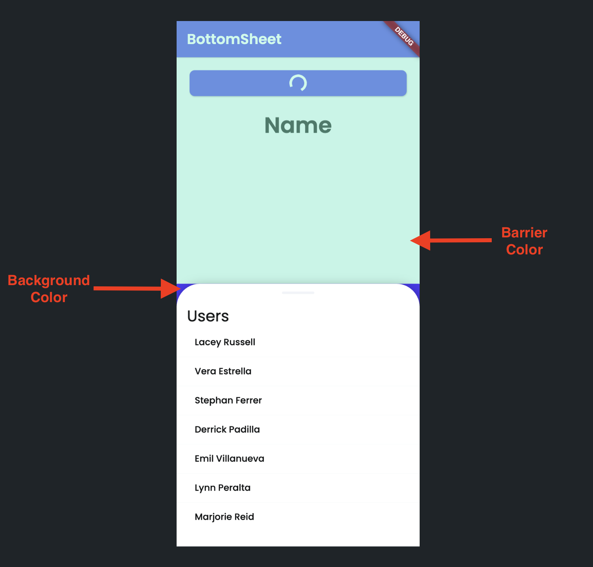

# Bottom Sheet
A Bottom Sheet is an alternative to a menu or a dialog. It opens from bottom to top and can be dismissed by swiping it from top to bottom. When it opens, it prevents the user from interacting with the rest of the app. 

You can use the bottom sheet when you want to perform a small action without creating a separate screen.

    <iframe 
        src="https://demo.arcade.software/4GbJ3ujPrnvX6MwYiGdY?embed&show_copy_link=true"
        title=""
        style={{
            position: 'absolute',
            top: 0,
            left: 0,
            width: '100%',
            height: '100%',
            colorScheme: 'light'
        }}
        frameborder="0"
        loading="lazy"
        webkitAllowFullScreen
        mozAllowFullScreen
        allowFullScreen
        allow="clipboard-write">
    </iframe>

## Types of Bottom Sheet action

Below are the types of Bottom Sheet actions:

1. **Show**: This opens the bottom sheet.
2. **Dismiss**: This closes the bottom sheet.

## Opening Bottom Sheet

Follow the steps below to add an action that opens the bottom sheet:

1. Create a bottom sheet [component](../../resources/ui/components/overview.md). Tip: you can also create one from the 'BottomSheet' templates.
    

    <iframe 
        src="https://demo.arcade.software/OfBRZFRhgkbMjHmXfEyo?embed&show_copy_link=true"
        title=""
        style={{
            position: 'absolute',
            top: 0,
            left: 0,
            width: '100%',
            height: '100%',
            colorScheme: 'light'
        }}
        frameborder="0"
        loading="lazy"
        webkitAllowFullScreen
        mozAllowFullScreen
        allowFullScreen
        allow="clipboard-write">
    </iframe>

    
2. Select the **Widget** (e.g., Button) from where you want to open the bottom sheet.
3. Select **Actions** from the Properties panel (the right menu), and click **+ Add Action**.
4. Search and select the **Bottom Sheet** (under *Widget/UI Interactions*) action.
5. To open the bottom sheet, select **Show**.
6. **Select Component** as the component you created for the bottom sheet.
7. (Optional) set the **Height** value. You should set the height if you want the bottom sheet to appear only up to some portion of the screen.
8. You can set the **Background** and **Barrier Color** for the bottom sheet.
    
    
    
9. You can also [pass parameters](../../resources/ui/components/custom-components/using-components.md#pass-down-values) to a bottom sheet component.
10. By default, this type of action blocks the following action (if any) from triggering while this action is in progress. (i.e., meaning the bottom sheet is present on the screen). However, in some cases, you might want to allow the next action (after this) to execute, for example, making an API call immediately after showing the bottom sheet. To do so, enable **Non Blocking** option.
11. By default, **Non Dismissble** option closes the bottom sheet when you click outside of it. To disable this behavior, enable this option.
12. With **Enable Drag** option, you can open and close the bottom sheet using a swipe gesture.
13. Optional: If you are returning any value from the bottom sheet, provide the **Action Output Variable Name**. The result will be stored in this variable.

    <iframe 
        src="https://www.loom.com/embed/def8de637f1a43f1bd5f443d59ba5c29?sid=ab58e43b-e6d0-49e9-a536-e349885b6e63"
        title=""
        style={{
            position: 'absolute',
            top: 0,
            left: 0,
            width: '100%',
            height: '100%',
            colorScheme: 'light'
        }}
        frameborder="0"
        loading="lazy"
        webkitAllowFullScreen
        mozAllowFullScreen
        allowFullScreen
        allow="clipboard-write">
    </iframe>

## Closing Bottom Sheet

Follow the steps below to add an action that closes the bottom sheet:

1. Select the **Widget** (e.g., Button, ListTile, Container) on which you want to add the action.
2. Select **Actions** from the Properties panel (the right menu), and click **+ Add Action**.
3. Search and select the **Bottom Sheet** (under *Widget/UI Interactions*) action.
4. To close the bottom sheet, select **Dismiss**.
5. If you want to return a value from the current bottom sheet, enable the **Has Value** toggle and pass the value by setting its *Data Type* and *Value Source*.
    1. If you enable the *Has Value* option, you must come back to the action that opens this bottom sheet and provide the **Action Output Variable Name**. This will be used to retrieve the value from the bottom sheet.
    2. Now you can use the *Action Output Variable Name* to get the data.

Here is an example of returning the selected user name back to the page.

    <iframe 
        src="https://demo.arcade.software/KDaNgnasSA3pZ9fxjBF5?embed&show_copy_link=true"
        title=""
        style={{
            position: 'absolute',
            top: 0,
            left: 0,
            width: '100%',
            height: '100%',
            colorScheme: 'light'
        }}
        frameborder="0"
        loading="lazy"
        webkitAllowFullScreen
        mozAllowFullScreen
        allowFullScreen
        allow="clipboard-write">
    </iframe>

