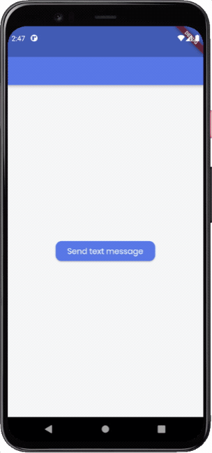

The Launch URL Action lets you specify a URL that will be opened using an app supporting it. If there is more than one app that can handle the specified URL, the user will be presented with a dialog from where one of the apps can be selected.

## Adding Launch URL Action

Follow the steps below to add this action to any widget.

1. Select the **Widget** (e.g., Container, Button, etc.) on which you want to add the action.
2. Select **Actions** from the Properties panel (the right menu), and click **Open**. This will open an **Action Flow Editor** in a new popup window.
3. Click on the **+ Add Action**.
4. On the right side, search and select the **Launch URL** (under widget/UI Interactions) action.
5. In the *URL Value Type* property, select either **Specify URL** (to add the URL as a String) or **From Variable** (to use the value stored in a String variable).
6. If using **Specify URL**, enter the URL that you want to use in the **URL** field. For example, you can enter "[https://flutter.dev](https://flutter.dev/)" to open the Flutter webpage.
7. If using **From Variable**, select the **Source** from which to fetch the URL value. You can also specify a **Default Value** that will be used when the variable value is not set (i.e. null).

---

## URL schemes

The following are some common URL schemes that can be handled by an external app present on the user's device.

### Open a webpage

This URL scheme for loading up a webpage can be defined in this format:

#### Scheme

`http:<webpage URL link>`

`https:<webpage URL link>`

#### Example

`https://flutter.dev`

### Use a phone number

This URL scheme helps to handle phone numbers inside your app. Using this, you can easily initiate a phone call to the provided phone number from the user's device.

#### Scheme

`tel:<phone-number>`

#### Example

`tel:2125551212`

### Compose a text message

This URL scheme lets you redirect users from your app to compose and send an SMS message to a specified phone number.

#### Scheme

`sms:<phone_number>`

#### Example

`sms:2125551212`

### Create an email

This URL scheme helps you to launch an email app on the user's device. It allows you to pass the *email to*, *subject*, and *body* to the app so that you have these fields prefilled with details as the email app is opened.

#### Scheme

`mailto:<email_address>?subject=<subject>&body=<body>`

#### Example

`mailto:name@example.org?subject=Welcome%20to%20FlutterFlow&body=Hey%20there`

This will pass the following details to the email app:

***mailto:*** name@example.org, ***subject:*** Welcome to FlutterFlow, ***body:*** Hey there

