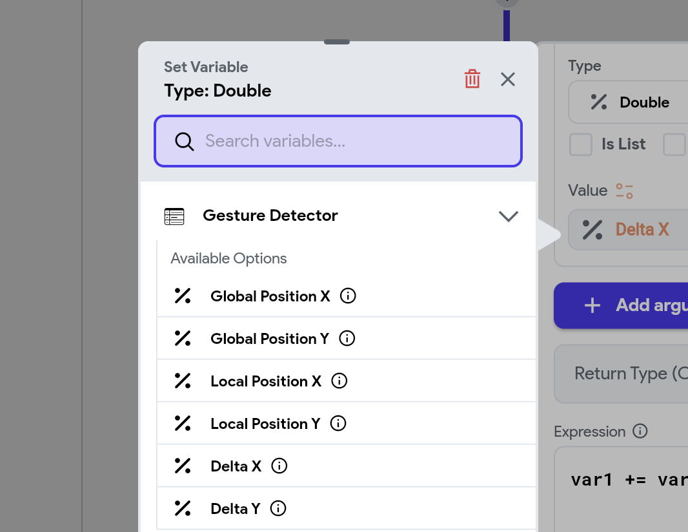

# Action Triggers

**Action Triggers** represent specific events that occur when a user interacts with the app, such as tapping a button, selecting an option from a dropdown, or loading a new page. When an Action Trigger is invoked by one of these interactions, it initiates a corresponding **Action**—a task or operation that responds to the event.

In essence, Action Triggers are the 'listeners' in your app, keeping an eye out for user interactions and signaling when it's time for your app to respond. By understanding and utilizing Action Triggers, you can craft a more dynamic and user-friendly application experience.

## Types of Action Triggers

### Basic Triggers

FlutterFlow provides several basic action triggers that can be easily added:

- **On Tap**: This trigger is activated when a user taps on a widget. For instance, you can use this trigger to display a [Snackbar message](../../ui/pages/page-elements.md#snackbar) when a [button](../../ui/widgets/basic-widgets/button.md) is tapped.
- **On Double Tap**: This trigger is activated when a user taps a widget twice quickly. A typical example might be zooming in on an image or photo when the user double-taps on it.
- **On Long Press**: This trigger is activated when a user presses and holds down on a widget for an extended period. A common use case is to show additional options or a context menu, such as allowing a user to delete or rename a file when long-pressing on it.

Here’s an example of showing a message on button click using the On Tap trigger:

    <iframe 
        src="https://demo.arcade.software/uI8KTjnmre4Cx901b6ws?embed&show_copy_link=true"
        title=""
        style={{
            position: 'absolute',
            top: 0,
            left: 0,
            width: '100%',
            height: '100%',
            colorScheme: 'light'
        }}
        frameborder="0"
        loading="lazy"
        webkitAllowFullScreen
        mozAllowFullScreen
        allowFullScreen
        allow="clipboard-write">
    </iframe>

### Widget Specific Triggers

Widget specific triggers are available on certain widgets. Here are they:

- **On Submit**: Triggered on the TextField widget when the user presses "submit" or "done," finalizing text entry.
- **On Page Load**: Available on the page widget, this trigger activates as soon as the page loads, useful for tasks like data fetching or content updates.
- **On Phone Shake**: Specific to the page widget, this trigger responds to physical shaking of the device, commonly used in games for actions like rolling dice.
- **On Selected**: Found on widgets like Dropdowns, CheckboxGroups, Sliders, RadioButtons, ChoiceChips, and RatingBars, this trigger activates upon any change in selection.
- **On Page Swipe**: Available on the PageView widget to trigger actions when the page is swiped.
- **On Toggle**: Available on the ToggleIcon widget, this trigger responds each time the toggle is activated.
- **On Completed, On Change**: Specific to the PinCode widget, these triggers activate when the user completes or alters a pin entry.
- **On Count Changed**: Present in the CountController widget, this trigger responds to changes in the count.

## Gesture Detector Triggers

Gesture Detector Triggers enable you to respond to user gestures, such as taps, drags, swipes, and pinches. These triggers are invoked based on specific gestures and allow you to add actions in response to user interactions. For example, the `onDoubleTap` trigger is invoked whenever a user quickly taps twice on a widget, which can be used to toggle a 'like' state or zoom in on content.

### Lifecycle stages

The lifecycle of gesture triggers involves four key stages: **Start**, **Update**, **End/Stop**, and **Cancel**. These stages dictate how gestures are detected and handled, from the initial interaction to completion or cancellation. Understanding this lifecycle is crucial for building intuitive gesture-based interactions in your app.

- **Start:** This is where the gesture begins, and it involves detecting the initial contact (like a touch, tap, or drag). Examples are:
        - `onHorizontalDragStart`: Fires when the user starts dragging their finger horizontally on the screen.
        - `onTapDown`: Fires when the user places their finger on the screen to initiate a tap.
- **Update:** The Update stage tracks the movement or progress of the gesture. During this stage, you can capture real-time data like the finger's position (`deltaX`, `deltaY`), which is useful for implementing interactive features. Examples are:
        - `onHorizontalDragUpdate`: Fired as the user drags their finger horizontally across the screen, allowing the app to track the distance moved.
        - `onScaleUpdate`: Tracks the scale gesture as the user pinches to zoom in or out.
- **End/Stop:** The End or Stop stage occurs when the user completes the gesture by lifting their finger, completing the action. Examples are:
        - `onHorizontalDragEnd`: Triggered when the user finishes dragging horizontally and lifts their finger off the screen.
        - `onPanEnd`: Fires when the user lifts their finger after completing a pan gesture (scrolling or dragging).
- **Cancel:** The Cancel stage occurs when the gesture is interrupted, either by the user or by another action, preventing the gesture from completing. Examples are:
        - `onHorizontalDragCancel`: Triggered when a horizontal drag is canceled due to some interruption (e.g., user releases finger before completing the drag).
        - `onTapCancel`: Fires when a tap is canceled, for instance, if the user moves their finger too much before lifting it.

#### Cancel before End

The gesture lifecycle doesn't always strictly follow the sequence of **Start**, **Update**, **End/Stop**. The **Cancel** stage can occur at any point, even before **End/Stop**, depending on the interaction. Here are couple of examples:

- **Tap Gesture**: If the user touches the screen but moves their finger too much before lifting, `onTapCancel` is triggered instead of `onTapUp`.
- **Drag Gesture**: If a horizontal drag is interrupted before the drag completes (for example, if another gesture takes precedence), `onHorizontalDragCancel` is triggered instead of `onHorizontalDragEnd`.

So, while most gestures follow the **Start ➡️ Update ➡️ End/Stop** flow, there are cases where the lifecycle stages sequence might be different. For example, see the visual below:

### Available Gesture Detector Triggers

Below is a complete list of available gesture detector triggers in FlutterFlow to enhance the capabilities of gesture-based interactions.

- **onDoubleTapCancel**: Triggered when a double-tap gesture is recognized but does not complete successfully.
- **onDoubleTapDown**: Triggered when the user presses down on the screen for the first tap in a double-tap sequence.
- **onForcePressEnd**: Triggered when the user releases a press that exceeds a certain force threshold.
- **onForcePressPeak**: Triggered when the force of a press reaches its peak.
- **onForcePressStart**: Triggered when the user begins pressing with enough force to pass a defined threshold.
- **onForcePressUpdate**: Triggered when the user changes the amount of pressure applied during a press.
- **onHorizontalDragCancel**: Triggered when a horizontal drag gesture is interrupted or canceled.
- **onHorizontalDragDown**: Triggered when the user first touches the screen and initiates a horizontal drag.
- **onHorizontalDragEnd**: Triggered when the user ends a horizontal drag gesture.
- **onHorizontalDragStart**: Triggered when the user begins a horizontal drag gesture.
- **onHorizontalDragUpdate**: Triggered continuously as the user drags horizontally.
- **onLongPressCancel**: Triggered when a long press gesture is recognized but doesn't complete.
- **onLongPressDown**: Triggered when the user first presses down on the screen with the intention of a long press.
- **onLongPressEnd**: Triggered when the user releases a long press.
- **onLongPressMoveUpdate**: Triggered as the user moves their finger while holding down during a long press.
- **onLongPressStart**: Triggered when the long press gesture starts after the user holds down for the required duration.
- **onLongPressUp**: Triggered when the user releases a long press after the hold duration.
- **onPanCancel**: Triggered when a pan gesture (general dragging) is interrupted or canceled.
- **onPanDown**: Triggered when the user first touches the screen with the intention of panning.
- **onPanEnd**: Triggered when the user ends a pan gesture.
- **onPanStart**: Triggered when the user begins a pan gesture.
- **onPanUpdate**: Triggered continuously as the user drags their finger across the screen.
- **onScaleEnd**: Triggered when the user ends a scaling gesture, such as pinch-to-zoom.
- **onScaleStart**: Triggered when the user begins a scaling gesture.
- **onScaleUpdate**: Triggered continuously as the user changes the scale (e.g., zooms in or out).
- **onSecondaryLongPress**: Triggered when the user presses and holds with a secondary pointer (e.g., two-finger press).
- **onSecondaryLongPressCancel**: Triggered when a secondary long press gesture is recognized but does not complete.
- **onSecondaryLongPressDown**: Triggered when the user first touches the screen with a secondary pointer intending to long press.
- **onSecondaryLongPressEnd**: Triggered when the user releases a secondary long press.
- **onSecondaryLongPressMoveUpdate**: Triggered as the user moves a secondary pointer while holding down during a long press.
- **onSecondaryLongPressStart**: Triggered when the secondary long press gesture starts after holding down for the required duration.
- **onSecondaryLongPressUp**: Triggered when the user releases a secondary long press after the hold duration.
- **onSecondaryTap**: Triggered when the user taps with a secondary pointer (e.g., two-finger tap).
- **onSecondaryTapCancel**: Triggered when a secondary tap gesture is recognized but does not complete.
- **onSecondaryTapDown**: Triggered when the user first touches the screen with a secondary pointer intending to tap.
- **onSecondaryTapUp**: Triggered when the user releases the screen after a secondary tap.
- **onTapCancel**: Triggered when a tap gesture is recognized but does not complete successfully.
- **onTapDown**: Triggered when the user first touches the screen with the intention of tapping.
- **onTapUp**: Triggered when the user releases the screen after a tap.
- **onTertiaryLongPress**: Triggered when the user presses and holds with a tertiary pointer (e.g., three-finger press).
- **onTertiaryLongPressCancel**: Triggered when a tertiary long press gesture is recognized but does not complete.
- **onTertiaryLongPressDown**: Triggered when the user first touches the screen with a tertiary pointer intending to long press.
- **onTertiaryLongPressEnd**: Triggered when the user releases a tertiary long press.
- **onTertiaryLongPressMoveUpdate**: Triggered as the user moves a tertiary pointer while holding down during a long press.
- **onTertiaryLongPressStart**: Triggered when the tertiary long press gesture starts after holding down for the required duration.
- **onTertiaryLongPressUp**: Triggered when the user releases a tertiary long press after the hold duration.
- **onTertiaryTapCancel**: Triggered when a tertiary tap gesture is recognized but does not complete successfully.
- **onTertiaryTapDown**: Triggered when the user first touches the screen with a tertiary pointer intending to tap.
- **onTertiaryTapUp**: Triggered when the user releases the screen after a tertiary tap.
- **onVerticalDragCancel**: Triggered when a vertical drag gesture is interrupted or canceled.
- **onVerticalDragDown**: Triggered when the user first touches the screen and initiates a vertical drag.
- **onVerticalDragEnd**: Triggered when the user ends a vertical drag gesture.
- **onVerticalDragStart**: Triggered when the user begins a vertical drag gesture.
- **onVerticalDragUpdate**: Triggered continuously as the user drags vertically.

### Accessing Gesture Detector XY Data

Gesture detectors not only recognize types of gestures but also provide the exact location (XY coordinates) where they occur. This feature is essential for apps that require precise interaction, like drawing applications or interactive maps.

Examples of using XY data include:

- **Drawing Apps:** Use the touch coordinates to let users paint or draw directly on their device screen.
- **Interactive Maps:** Implement gestures to navigate around the map or adjust the zoom level based on where the user touches.
- **Dynamic Interfaces:** Create effects that react to touch, like animations that start from where the user taps the screen.

You can access the Gesture Detector XY data after adding the relevant gesture detector triggers. Once added, you can retrieve this data via the Set from Variable menu inside the Action Flow Editor. Depending on your specific needs, you can choose from the following options:

- **Global Position X**: The x-coordinate of the pointer relative to the left edge of the screen when the gesture was triggered.
- **Global Position Y**: The y-coordinate of the pointer relative to the top edge of the screen when the gesture was triggered.
- **Local Position X**: The x-coordinate of the pointer relative to the left edge of the widget that detected the gesture.
- **Local Position Y**: The y-coordinate of the pointer relative to the top edge of the widget that detected the gesture.
- **Delta X**: The horizontal distance the pointer moved during the gesture.
- **Delta Y**: The vertical distance the pointer moved during the gesture.

See how to effectively use gesture detector triggers and access XY data in the following example.

### Example: Swipe to delete cart items

Let's walk through an example that demonstrates how to implement a "Swipe to Delete" feature for cart items **entirely** using Gesture Detectors. Here's a preview of how it works:

    <iframe 
        src="https://demo.arcade.software/Oh2BywKkUPHOmF4RmttY?embed&show_copy_link=true"
        title=""
        style={{
            position: 'absolute',
            top: 0,
            left: 0,
            width: '100%',
            height: '100%',
            colorScheme: 'light'
        }}
        frameborder="0"
        loading="lazy"
        webkitAllowFullScreen
        mozAllowFullScreen
        allowFullScreen
        allow="clipboard-write">
    </iframe>

Here’s how you do it:

1. First, we create a variable called `offsetX` to track the horizontal drag distance of the cart item. Since the cart item is displayed in a **ListView** and is built as a reusable component, we'll define `offsetX` as a **component state variable**. This ensures that each cart item independently tracks its own drag position.

    

2. Now, to make the item move as the user drags it, we add a **slide animation** (under **On Action Trigger**) to the Container that holds the item's layout. While configuring the animation, set the **Duration** to 0 and the **Final Position** to the `offsetX` variable. This ensures that the item follows the user's finger as they swipe.

    :::info
    We'll trigger this animation every time the user swipes by listening to the `onHorizontalDragUpdate` event (see how to do it in next step).
    :::

    

3.  On the main Container, we add the `onHorizontalDragUpdate` action trigger. This will called continuously as the user drags the item horizontally. On this event, we update the `offsetX` variable with the new position based on the swipe movement (using **Delta X** Data) and trigger the animation. This real-time update makes the item slide on the screen.

    

        <iframe 
            src="https://demo.arcade.software/E3H0XAAY1AO7VaoZbNHw?embed&show_copy_link=true"
            title=""
            style={{
                position: 'absolute',
                top: 0,
                left: 0,
                width: '100%',
                height: '100%',
                colorScheme: 'light'
            }}
            frameborder="0"
            loading="lazy"
            webkitAllowFullScreen
            mozAllowFullScreen
            allowFullScreen
            allow="clipboard-write">
        </iframe>
    

    

4. Now we need to check if the swipe meets the threshold to delete the item or reset the item's position back to its original location. For that, we add the `onHorizontalDragEnd` trigger. In the `onHorizontalDragEnd` trigger, we check if the `offsetX` value exceeds 100. If it does, we send the item index back to the page or component (via execute callback action) to delete the item from the list. If not, we reverse the slide animation. Lastly, we reset the `offsetX` value to 0 to ensure it's ready for the next interaction.

    

        <iframe 
            src="https://demo.arcade.software/HQOWI06X33hGFms27T4G?embed&show_copy_link=true"
            title=""
            style={{
                position: 'absolute',
                top: 0,
                left: 0,
                width: '100%',
                height: '100%',
                colorScheme: 'light'
            }}
            frameborder="0"
            loading="lazy"
            webkitAllowFullScreen
            mozAllowFullScreen
            allowFullScreen
            allow="clipboard-write">
        </iframe>
    

    

