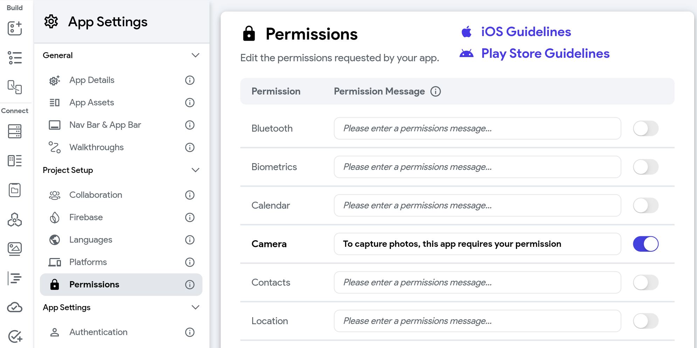

import Tabs from '@theme/Tabs';
import TabItem from '@theme/TabItem';

# Project Setup

Setting up project in FlutterFlow ensures that your app is prepared to provide a robust and user-friendly experience across different platforms and regions. By adding necessary permissions, enabling multiple platforms, and supporting multiple languages, you can expand your app's reach and functionality while maintaining high standards of performance and user satisfaction.

## Permissions

In your app, you must be open and get upfront consent before using the user's private information, such as location, health data, photos, or any information that reveals their identity via the camera and/or microphone. This is done by adding a permission flow just before accessing the data.

We automatically add permissions whenever you add features that access the user's private data. The only thing left for you is to add the permission messages. Adding permission messages helps users clearly understand how your app will use the data it is requesting for.

:::info
- You can't show the custom permission message on Android, so the message(s) added here are displayed only on iOS devices. To write a clear permission message, please visit the help guide [**here**](https://developer.apple.com/design/human-interface-guidelines/patterns/accessing-private-data/#requesting-permission).
- You can't turn off the permission (with messages) added by us to prevent issues that might come after submitting your app for review.
- See how to [**request permission**](#request-permission-action).
:::

<figure>
    
  <figcaption class="centered-caption">Asking for camera permission before capturing a photo</figcaption>
</figure>

### Adding permission message

Although we add some default permission messages, you must change them to clearly mention the reason for asking the permission(s).

To add permission message:

1. Select **Settings & Integrations** from the left Navigation Menu.
2. Under the **Project Setup**, select **Permissions**.
3. Here you can customize the permission message for each permission. For the permissions that are not added/enabled yet, you can turn on the toggle and enter the message. On running the app, this message will be displayed inside the standard alert dialog (between your app name and action buttons).

For the already added permission (which you can't turn off), if you leave the message empty, the message displayed as a hint will be shown inside the permission dialog.

### Adding custom permission

Sometimes you might add a feature (probably using Custom Widget or Custom Action) that requires user permission and is not present in the list here—for example, adding a speech recognition feature to your project. In that case, you can add the required permission along with the message for the Android and/or iOS from here.

To add custom permission:

1. Select **Settings & Integrations** from the left Navigation Menu.
2. Under the **Project Setup**, select **Permissions**.
3. Click on the **+ Add Permission**.
4. Inside the **iOS Permission key** enter the value (e.g. *NSSpeechRecognitionUsageDescription*, *NSMicrophoneUsageDescription* etc.).
5. Inside the **Android Permission name** enter the value (e.g., *RECORD_AUDIO*, *CAMERA*, etc.).
6. Also, enter the **Permission Message** that describes the exact usage of data.
7. Click on the Done icon on the right.
    

    <iframe 
        src="https://demo.arcade.software/AuxM1ChTm1v5mh59LfYK?embed&show_copy_link=true"
        title=""
        style={{
            position: 'absolute',
            top: 0,
            left: 0,
            width: '100%',
            height: '100%',
            colorScheme: 'light'
        }}
        frameborder="0"
        loading="lazy"
        webkitAllowFullScreen
        mozAllowFullScreen
        allowFullScreen
        allow="clipboard-write">
    </iframe>

:::info[Adding translation for messages]
You can also add multilingual permission messages by following the instructions [**here**](#).
:::

### Request Permission [Action]

Using this action, you can request permission before accessing the user's private information, such as location, voice, contacts, and photos.

This action is helpful when you add a custom widget or action that accesses the user's personal information and does not have an inbuilt permission mechanism.

:::info
- Request permission only works on a mobile platform.
- There won't be any dialog shown for the *Bluetooth* and *Notifications* permissions.
:::

<Tabs>
<TabItem value="1" label="Allow permission" default>

    <iframe 
        src="https://demo.arcade.software/EbHqL6taiZfjFhxrQsJK?embed&show_copy_link=true"
        title=""
        style={{
            position: 'absolute',
            top: 0,
            left: 0,
            width: '100%',
            height: '100%',
            colorScheme: 'light'
        }}
        frameborder="0"
        loading="lazy"
        webkitAllowFullScreen
        mozAllowFullScreen
        allowFullScreen
        allow="clipboard-write">
    </iframe>

</TabItem>
<TabItem value="2" label="Reject permission">

    <iframe 
        src="https://demo.arcade.software/6L0VxKxig1wu3uBLoGZq?embed&show_copy_link=true"
        title=""
        style={{
            position: 'absolute',
            top: 0,
            left: 0,
            width: '100%',
            height: '100%',
            colorScheme: 'light'
        }}
        frameborder="0"
        loading="lazy"
        webkitAllowFullScreen
        mozAllowFullScreen
        allowFullScreen
        allow="clipboard-write">
    </iframe>

</TabItem>
</Tabs>

#### Adding Request Permission action

Follow the steps below to add this action to any widget.

1. Select the **Widget** (e.g., Button) on which you want to add this action.
2. Select **Actions** from the Properties panel (the right menu), and click **Open**. This will open an **Action flow Editor** in a new popup window. If it's the first action, click **+ Add Action** button. Otherwise, click the "**+**" button below the previous action tile and select **Add Action**.
    1. Search and select the **Request Permissions** (under *Alerts/Notifications*) action.
    2. Set the **Permission Type** to the one you need. Only the permissions for which the message is present are shown here.
    3. Now you must check if the permission was granted or rejected. You can do so by adding the conditional action. To do so, click the "**+**" button below the previous action tile and select **Add Conditional**.
    4. From the **Set Variable** menu, select **Permission > Permission name** (this should be the permission you requested for).
        1. The **TRUE** section represents success, meaning permission was granted. Here you can add any action that informs users or access their data.
        2. The **FALSE** section represents failure, meaning permission was denied. Here you can add any action that informs users about the permission they have denied.
    5. Click **Close**.

<Tabs>
<TabItem value="1" label="Adding Request Permission action" default>

    <iframe 
        src="https://demo.arcade.software/VqE2ZlW81599AWwCJALw?embed&show_copy_link=true"
        title=""
        style={{
            position: 'absolute',
            top: 0,
            left: 0,
            width: '100%',
            height: '100%',
            colorScheme: 'light'
        }}
        frameborder="0"
        loading="lazy"
        webkitAllowFullScreen
        mozAllowFullScreen
        allowFullScreen
        allow="clipboard-write">
    </iframe>

</TabItem>
<TabItem value="2" label="Request permission action flow">

</TabItem>
</Tabs>

--- 
## Platforms
By default, the generated project can run on Android, iOS, and the Web without any additional effort. However, to run your app on the desktop, you need to enable a platform (e.g., MacOS, Windows, Linux) from this page.

### Advanced Android Settings

- **Kotlin Version**: There are various situations where you may need to modify or configure the Kotlin version in your Android project. This could include updating to the latest version, adapting the version to accommodate a specific library or tool, or other specific requirements. To change the default version, enter the value here.
- **Minimum SDK Version**: This defines the lowest version of Android that your app can run on. Setting a higher minimum SDK version ensures your app can use newer APIs and features but may limit the devices that can install it.
- **Compile SDK Version**: This refers to the version of Android that your code is compiled against. It determines the APIs your app can use. To change it, enter the desired SDK version here.
- **Target SDK Version**: This is the version of Android that your app is intended to run on. It helps Android ensure forward compatibility by applying certain behavior changes only if the target SDK is high enough. To adjust this, enter the desired version here.

---

### Advanced iOS Settings

- **Disable iPad Support:** If the app is specifically designed for an iPhone and doesn't provide a good user experience on an iPad, you might want to trun on this setting.
- **Minimum iOS Version**: This specifies the lowest version of iOS that your app can run on.

---

### Advanced Web Settings

- **Use Original Engine Initialization**: This setting uses the original Flutter web engine initialization, which can sometimes improve loading times in deployed web apps. Enable this option if you experience performance issues with the custom initialization process.
- **Use CanvasKit**: CanvasKit provides better performance and fidelity for rendering on the web by leveraging WebAssembly. This setting can improve the visual quality and performance of your app, especially for complex graphics and animations. Enable this option to use CanvasKit for rendering on the web.

---

## Multiple Languages
To support multiple languages in your app, refer [here](#).