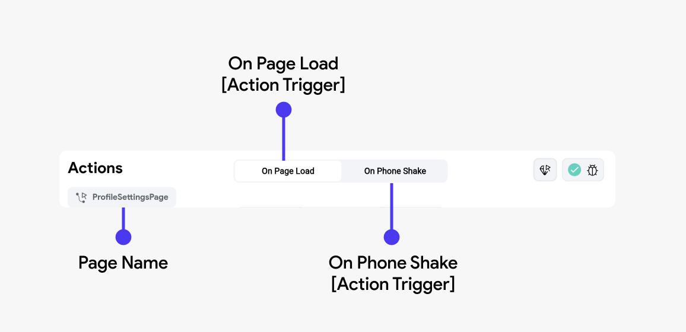
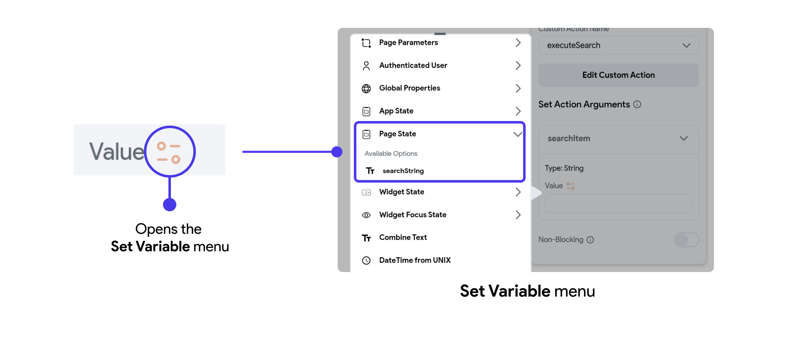

# Page Lifecycle

In FlutterFlow and Flutter, understanding the page lifecycle or simply the stages a page goes
through from creation to disposal is essential for managing resources and data effectively.

Let's delve into the key moments in the lifecycle of a **Page**:

- **Initialization**: This is the first phase where the page is set up. Here the initial data is 
  loaded. This might involve setting up the necessary state or defaults for the
  page.
- **Rendering**: Here, the page is actually drawn or rendered on the screen. This includes
  setting up the layout, styles, and any interactive elements. The user can now see the page in its
  initial [state](#page-state).
- **Updating:** After rendering, the page becomes interactive and can respond to user inputs such as
  clicks, typing, or other gestures. It may re-render parts of the page or the entire page to
  reflect the changes due to interaction or new data.
- **Disposal**: When the page is no longer needed, or the user navigates away, this phase is
  triggered. This is where resources related to the page are released from memory and are no longer
  accessible. 

In FlutterFlow, most of these lifecycle phases are handled internally by FlutterFlow's architecture.
However, we expose some of the methods so that you, as a developer, can decide what additional
configurations to load upon initialization and when to re-render the UI based on interactions. 

Let's read more about them in the following sections:

## Initialization Action Triggers

During the initialization of a **Page**, we provide several **[Action Triggers](../../control-flow/functions/action-flow-editor.md#action-triggers)** that assist you in
loading resources or initializing data. These triggers ensure that all necessary data is prepared
and ready for use by the time the first frame of the **Page** is rendered.

:::info[What are Action Triggers?]
**Action Triggers** serve as event listeners or handlers that respond to
specific events or user interactions within an application. FlutterFlow provides
developers with a way to define logic that responds to various events, such as
button clicks, page loads, form submissions, or data changes.
To learn more, head over to **[Action Flow Editor](../../../resources/control-flow/functions/action-flow-editor.md)** section.
:::

As you open the [Action Flow Editor](../../../resources/control-flow/functions/action-flow-editor.md) for your Page, you can see the following Action
Triggers exposed for your Page.

### On Page Load [Action Trigger]

This allows you to set actions when the page loads or
initializes. It enables developers to perform tasks or execute logic at
specific points in the page lifecycle, such as fetching data from an API, initializing
variables or updating UI elements.

:::tip[Possible usecases]

- **Initializing Data:** You can use the **On Page Load** action trigger to initiate API calls,
database queries, or read from local storage, setting up the data that the page
needs to display. This ensures that all necessary data is ready and available by
the time the user sees the page.

- **Setting State:** If your page depends on certain state conditions (like toggles,
selections, or input fields), you can set these states appropriately as the page
loads.

- **Running Animations:** Start animations that welcome users or draw attention to
certain UI elements on the page.
  :::

To add an action to **On Page Load** action trigger, follow the steps:

<iframe src="https://demo.arcade.software/ii0otHqkoRtPY66n4c2y?embed&show_copy_link=true" title="app.flutterflow.io/authentication" frameborder="0" loading="lazy" webkitallowfullscreen mozallowfullscreen allowfullscreen allow="clipboard-write" width="100%" height="600"></iframe>

### On Phone Shake [Action Trigger]

Actions added under this trigger are triggered when the
user shakes their phone. This is useful when you want to perform certain tasks or
trigger specific actions in response to a phone shake gesture.

:::tip[Possible usecases]

- **Randomizing content:** Shake the phone to generate a random number, display a random quote, or
  change the background image.
- **Refreshing data:** Shake the phone to trigger a data refresh, such as
  fetching the
  latest news articles or updating a live feed.
- **Resetting the app state:** Shake the phone to reset the app state, clear
  form
  fields, or return to the app's home screen.
  :::

### On Shortcut Press [Action Trigger]

This action trigger allows you to bind keyboard shortcuts to actions. This is incredibly helpful for improving accessibility and enhancing user experience, especially in web and desktop apps.

:::tip[Possible usecases]

- **Create New Issues in Project Management Apps:** In project management apps like Linear, users can press `C` to quickly open a form for creating a new issue or task.
- **Form Submission:** Users can press a key combination (e.g., `Ctrl + Enter`) to submit a form.
- **Navigating Between Pages:** Use shortcuts like `Ctrl + Right Arrow` to navigate between pages without using the mouse.
:::

:::info[important]
- When a keyboard shortcut is created at the page level, it won't trigger if a TextField is in focus, and you also won’t be able to type the shortcut key into the TextField.
- When a keyboard shortcut is created at the component level, it also won't trigger if a TextField is in focus, but you’ll still be able to type the shortcut key into the TextField.
- **To avoid conflicts, it's recommended to use shortcuts that users are unlikely to type, such as Command + S, instead of a single key like 'S'.**
- There’s currently a known issue with Flutter's autofocus functionality. If a TextField inside a component has autofocus enabled, and the component has a keyboard shortcut, the TextField will not autofocus as expected.
:::

Implementing keyboard shortcuts is a straightforward process in FlutterFlow. You can define as many shortcuts as you want, each mapped to specific actions that will trigger when the corresponding key combination is pressed. Let’s see an example of an eCommerce web app where users can quickly access the cart page by pressing the `C` key.

Here’s how you do it:

    <iframe 
        src="https://demo.arcade.software/ABFMLi4ozS0u5xKOTjwi?embed&show_copy_link=true"
        title=""
        style={{
            position: 'absolute',
            top: 0,
            left: 0,
            width: '100%',
            height: '100%',
            colorScheme: 'light'
        }}
        frameborder="0"
        loading="lazy"
        webkitAllowFullScreen
        mozAllowFullScreen
        allowFullScreen
        allow="clipboard-write">
    </iframe>

## Page state

:::note[State Variables]
A state variable holds information or data about your UI at any given moment. To learn more
about **states and state management, [refer here](../../../ff-concepts/state-management/state-variables.md)**
:::

**Page state** refers to the information that a page tracks about its current
condition or the data it displays. This can include things like which tabs are
active, the contents of a form, or any user interactions. Managing state is
crucial for dynamic pages that interact with user inputs or load varying data. Page State 
variables are only accessible within the given Page scope. 

This type of variable can be useful for storing data that needs to be shared between different
widgets on the page, such as saving form data, a search query, and filtering and sorting options.

For example,

- In a multistep form, you might use a **Page State** variable to store the current
  step number or the user's input for each step.
- Or, on a search results page, you could use a **Page State** variable to store the search
  query entered by the user and the current filtering and sorting options applied to the results.

This allows you to maintain the state of the page as the user interacts with different widgets and
components.

When the value of a **Page State** variable is changed, you can choose to re-render the page with
the
updated values, and it will display a new version of the page with these updates.

### Creating a Page State

To create a new Page State variable in your page, follow the steps:

    <iframe 
        src="https://demo.arcade.software/Qhg62nqMjhg8973XPQhb?embed&show_copy_link=true"
        title="Create Page State"
        style={{
            position: 'absolute',
            top: 0,
            left: 0,
            width: '100%',
            height: '100%',
            colorScheme: 'light'
        }}
        frameborder="0"
        loading="lazy"
        webkitAllowFullScreen
        mozAllowFullScreen
        allowFullScreen
        allow="clipboard-write">
    </iframe>

<figure>

  <figcaption class="centered-caption"></figcaption>
</figure>

While creating a Page State, the following properties are included:

- **Is List:** This property determines whether the variable can hold multiple
  values of the same data type (like a list or array) or just a single value.

- **Initial Field Value:** This property sets the default value for the variable
  when it is first created. It's like setting the starting point or the value that
  the variable begins with before anything else happens.

- **Nullable:** This property determines whether the variable can have a null
  value.
  When "**Nullable**" is set to true, it means the variable can be empty or have a
  null value. This is useful when dealing with optional data or scenarios where
  the absence of a value is valid.

Now, let's apply these concepts to the `searchString` variable in the context of
the above example:

- Since `searchString` is used to store a single search query entered by the user in the search
  bar, "**Is List**" is set to false, therefore it can hold only one value at
  a time.

- The default value for `searchString` is set to an empty string (""). This ensures that when the
  homepage loads, the search bar is
  initially empty, allowing users to enter their search query.

- Since entering a search query is optional and the search bar can be left empty, "**Nullable**" is
  set to true. This allows the `searchString` variable to be null until the user enters a search
  query, indicating that no search has been
  performed yet.

:::note
You can set the Data Type of your Page State variable to any primitive data types such as **String,
Integer, Boolean, Double** or to any other complex built-in data types such as **Enum, Custom Data
Type, Document,** etc. To learn more about the available data types, refer the [**Data
Representation Section.** ](../../data-representation/overview.md)
:::

### Get Page State value

You can access the **Page State** value anywhere on the current page. Any widget can hold the
current value of a given Page State variable, either for directly displaying it in the UI or for
transactional logic.

You can set the source value of the widget wherever you see the following icon. This icon indicates
that you can link the widget’s value to a variable.

### Update Page State [Action]

Page State values can only be updated via **Actions**. Whenever you want to
update the page state, such as through a button click, user interaction, or form
update, create a new Action called **Update Page State**.

    <iframe 
        src="https://demo.arcade.software/ezZO22YHQDqTHeg0uQ8Q?embed&show_copy_link=true"
        title="Update Page State"
        style={{
            position: 'absolute',
            top: 0,
            left: 0,
            width: '100%',
            height: '100%',
            colorScheme: 'light'
        }}
        frameborder="0"
        loading="lazy"
        webkitAllowFullScreen
        mozAllowFullScreen
        allowFullScreen
        allow="clipboard-write">
    </iframe>

<figure>
    
  <figcaption class="centered-caption"></figcaption>
</figure>

#### Rebuild on Update

When updating your page state in Flutter, you'll often come across the **Update
Type** property in your Action properties. Here's what it means:

**Rebuild Current Type:** This option triggers a re-rendering of the page,
ensuring
that any changes to the state are reflected in the user interface (UI).

**No Rebuild:** Choose this option when you need to update the state without
immediately reflecting the changes in the UI.

:::warning[Expensive Rebuilds]
Too many rebuilds can impact performance because rebuilding the widget tree
frequently consumes resources and may lead to decreased responsiveness and
increased battery usage. Therefore, it's essential to consider the trade-offs
and use rebuilds judiciously to maintain optimal app performance.

To learn more about what happens behind the scenes, refer to
the [Generated Page] section.
:::

