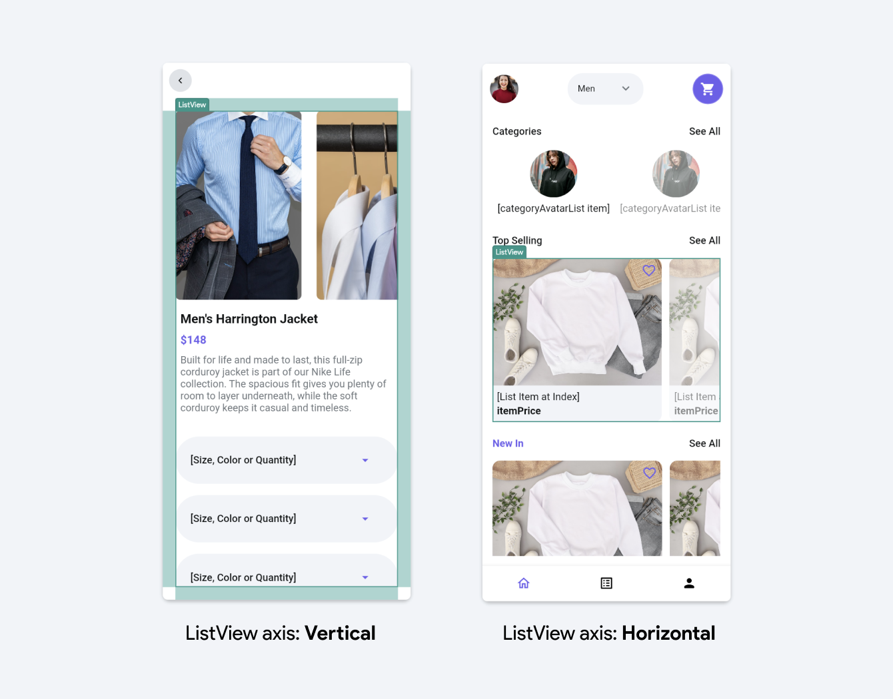
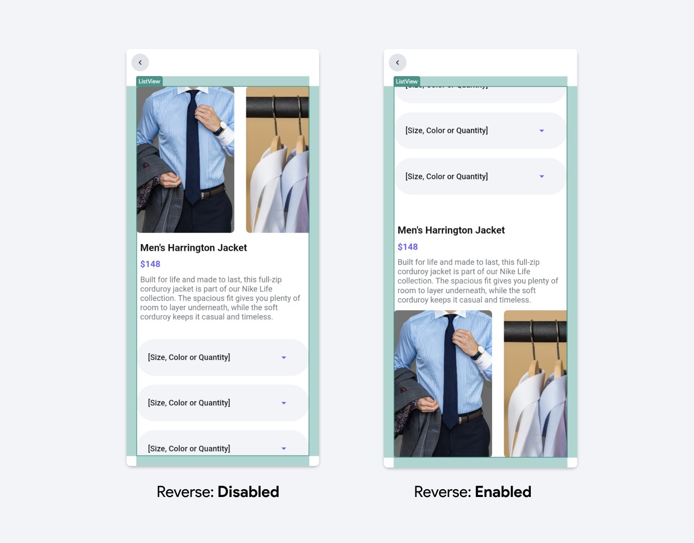
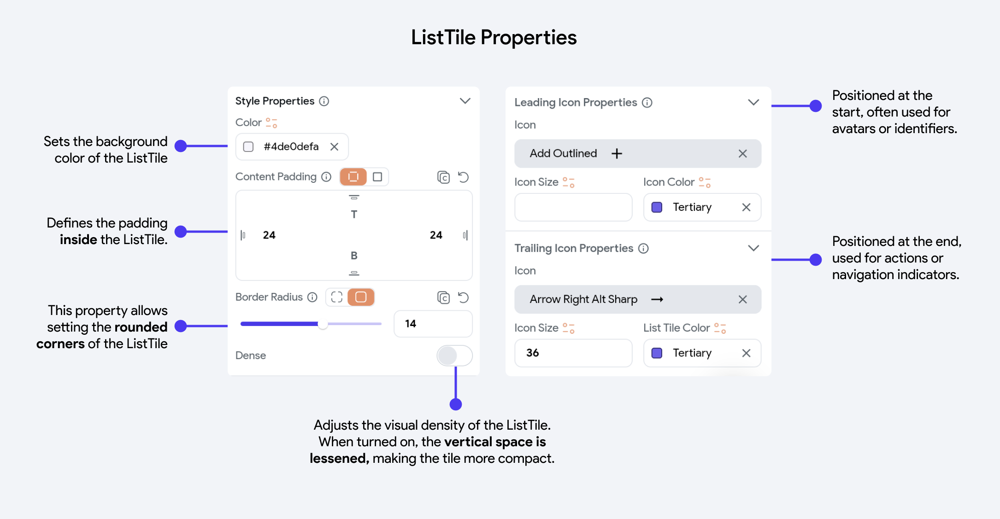
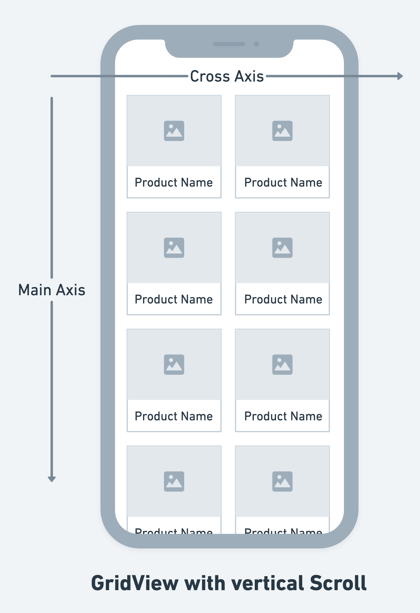
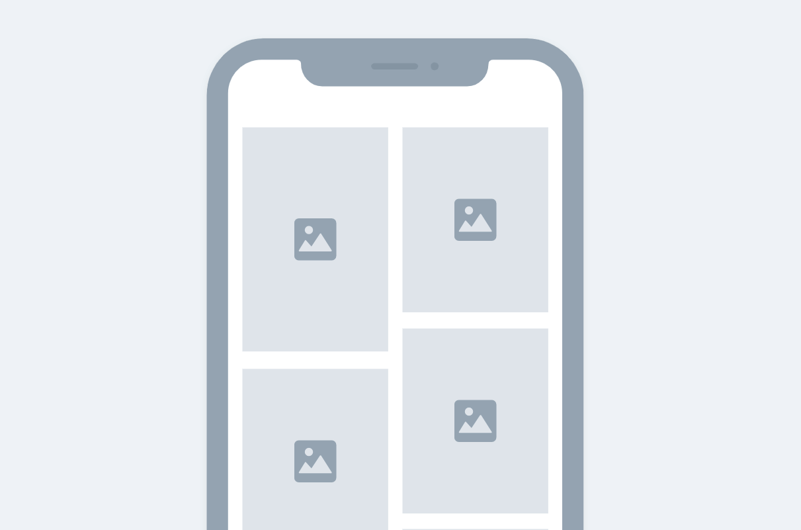
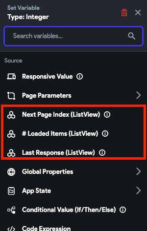
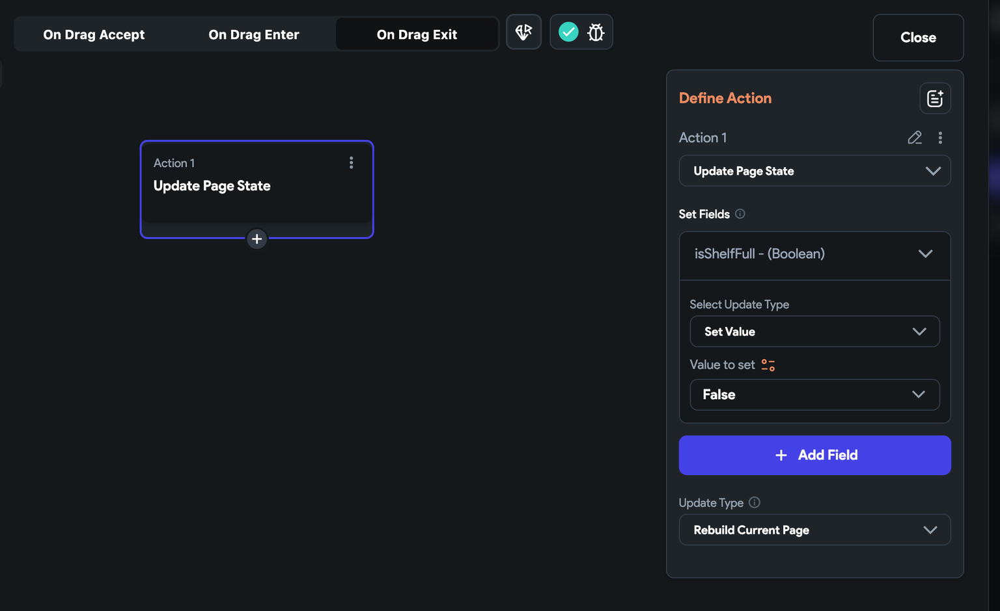

import Tabs from '@theme/Tabs';
import TabItem from '@theme/TabItem';

In FlutterFlow, `ListView` and `GridView` are versatile widgets designed for displaying lists and grids 
of elements, respectively. Both are highly customizable and optimized for dynamic content displays, making them essential for any app that requires scrolling through a collection of items such as images, text, or interactive elements.

## ListView Widget
ListView is a scrollable list of widgets arranged linearly. It is ideal for scenarios where items need to be displayed one after another, either **vertically or horizontally**.

It is particularly useful for long lists that need to be efficient; only the items visible on the 
screen are rendered, enhancing performance for lists with a large number of elements.

You can customize the ListView properties and functionalities, some are as follows: 

### Axis

Axis sets the orientation of the ListView. You can select either "Vertical" or
  "Horizontal" depending on whether you want the list to scroll vertically or horizontally.



### Spacing 

- **Items Spacing:** This defines the space between individual items in the ListView. You can
  specify the spacing in pixels.

- **Apply to Start & End:** When enabled, the item spacing will also be applied to the start and the
  end of the ListView, adding a margin at the beginning and end of the list. This effectively adds padding at the start and end of the layout in addition to between the items.

- **Start Spacing and End Spacing:** These properties allow you to set additional spacing at the
  start and end of the ListView, respectively. This can be used to create padding around the list items that is separate from the spacing between the items.

### Advanced Functionalities

- **Shrink Wrap:** When this property is enabled, the ListView will size itself to the total size of
  its children, meaning it won’t take more space than necessary. This is useful for lists that do not need to be scrollable because they fit within their constraints.

- **Primary:** If set to true, the ListView will act as the primary scrolling view in the context.
  This usually affects how the view interacts with other scrolling views and whether it stretches to fill the viewport. [**See more info here**](#primary-property).

- **Reverse:** In lists, when the reverse property is enabled, it reverses the order in which items appear in the ListView. For a vertical list, this means starting from the bottom and for a horizontal list, starting from the right.



#### Make List Reorderable
Whether to allow reordering of items in the list. On Web or Desktop this will 
add drag handles, but on mobile
  the reorder is triggerred by long pressing an item.

:::info[Note]
This will not automatically persist the order of items
in the list, but instead lets you define an action under **"On Reorder**" 
action trigger to make any necessary changes yourself.
:::

:::danger[CONTENTs of a Reorderable List]
**Reorderable ListView** must have dynamic children otherwise enabling this will throw an error. 
:::

Here's a quick tutorial to set up your Reorderable ListView:

##### Using App State variable

1. First, create an app state variable with a few items of type String and display them on the 
ListView widget.

2. Then, select the ListView, head over to the **Properties Panel > ListView Properties**, and 
enable 
the **Reorderable** property.

3. Select Actions from the properties panel (the right menu), and open the **Action Flow Editor.**

4. You'll see an **On Reorder** action trigger. Actions under this are triggered when a user 
  completes repositioning an item in the UI. But, we also need to update the item position in the 
  actual list as well. To do so, we can create a custom action that will modify the item index in the list. 
   1. Create a custom action with three arguments that accept the actual list, old index, and new 
   index. Tip: You'll get the old and new index from Set Variable menu > Reorderable ListView.
   2. Here's the custom code with explanation

  ```
  // Define a function called reorderItems that returns a Future of a list of strings.
// It takes in a list of strings, an old index, and a new index as parameters.
Future<List<String>> reorderItems(
List<String> list,
int oldIndex,
int newIndex,
) async {
// If the item is being moved to a position further down the list
// (i.e., to a higher index), decrement the newIndex by 1.
// This adjustment is needed because removing an item from its original
// position will shift the indices of all subsequent items.
if (oldIndex < newIndex) {
newIndex -= 1;
}

// Remove the item from its original position in the list and store
// it in the 'item' variable.
final item = list.removeAt(oldIndex);

// Insert the removed item into its new position in the list.
list.insert(newIndex, item);

// Return the modified list.
return list;
}
```

5. The custom action returns the modified list, which you can use to update the actual list using the update app state variable action.

<div class="video-container"><iframe src="https://www.loom.
com/embed/bb961c71d11a4e7d8869170727d1423d?sid=a356162d-76df-45bb-930c-bebf8358ce6c" frameborder="0" allow="accelerometer; autoplay; clipboard-write; encrypted-media; gyroscope; picture-in-picture; web-share" referrerpolicy="strict-origin-when-cross-origin" allowfullscreen></iframe></div>


##### Reordering Items in a Firebase Query

If you want to reorder the list items retrieved via Firebase query collection, the steps are almost similar except for the following changes.

:::danger[Caution]
Reordering items in a Firebase query is only suited for smaller lists. For larger datasets, this method can be inefficient and might lead to performance issues. Additionally, frequent writes and updates to Firebase can increase costs significantly.
:::

1. Create 'order' field in the collection.
2. Query collection order by 'order' field.
3. Ensure that the Infinite scroll is disabled.
4. Replace the custom action code with the below one:
```dart
Future reorderFirebaseItems(
  List<PlaylistRecord> list,
  int oldIndex,
  int newIndex,
) async {
  // If the item is being moved down the list, we adjust the newIndex.
  if (oldIndex < newIndex) {
    newIndex -= 1;
  }

  // Remove the item from its current position in the list.
  final PlaylistRecord item = list.removeAt(oldIndex);
  
  // Insert the item into its new position.
  list.insert(newIndex, item);

  // Create a batch to combine multiple Firestore operations into one.
  final batch = FirebaseFirestore.instance.batch();

  // Iterate through the list and update the order field for each document in Firestore.
  for (int i = 0; i < list.length; i++) {
    final PlaylistRecord doc = list[i];
    // Update the 'order' field of the document with its new index. 
    // This assumes that you have an 'order' field in Firestore where you store the order of the items.
    batch.update(doc.reference, {
      'order': i
    }); 
  }

  // Commit all the batched operations to Firestore.
  return await batch.commit();
}


```
<div class="video-container"><iframe src="https://www.loom.
com/embed/60617cd7b3c04e578747b3c0112567ed?sid=8331e6d4-7f55-4a4c-bf12-34efe3b42ce1" frameborder="0" allow="accelerometer; autoplay; clipboard-write; encrypted-media; gyroscope; picture-in-picture; web-share" referrerpolicy="strict-origin-when-cross-origin" allowfullscreen></iframe></div>

<p></p>

## ListTile widget 

The `ListTile` widget is a versatile component designed for displaying rows in a list, commonly 
used for menus, drawers, and lists where each row consists of multiple elements aligned horizontally. `ListTile` is particularly useful when you need a standardized row layout that includes elements a main title, a subtitle, and interactive icons at the start or end of the row. It saves time compared to constructing custom row layouts from scratch while ensuring visual consistency.

:::tip[When to Use ListTile Over Custom Components]
ListTile should be used when you require a simple, effective layout with standard elements and interactions. It is ideal for:

- Lists where items have a uniform structure.
- Quick assembly of functional interfaces without needing complex customization.
- Scenarios requiring integrated touch feedback and accessibility features which ListTile 
  provides by default.

:::

You can customize the Title (Text), Subtitle (Text) and Icon properties from the Properties Panel



:::info
To learn about how to customize the Text widgets in this component, refer the [**Text widget**](../basic-widgets/text.md). 
:::

### Convert into SlidableListTile

The ListTile in FlutterFlow offers an additional functionality—it can easily be transformed into a slidable version. This enhanced ListTile allows you to embed actions that users can access by sliding the tile to the left, adding a layer of interactivity and utility to the standard list item.

Here's how you can enable the Slidable functionality of a ListTile and modify the properties of 
the Actions: 

<div style={{
    position: 'relative',
    paddingBottom: 'calc(56.67989417989418% + 41px)', // Keeps the aspect ratio and additional padding
    height: 0,
    width: '100%'
}}>
    <iframe 
        src="https://demo.arcade.software/oJpg6I5T9YeZzp8O75Xc?embed&show_copy_link=true"
        title=""
        style={{
            position: 'absolute',
            top: 0,
            left: 0,
            width: '100%',
            height: '100%',
            colorScheme: 'light'
        }}
        frameborder="0"
        loading="lazy"
        webkitAllowFullScreen
        mozAllowFullScreen
        allowFullScreen
        allow="clipboard-write">
    </iframe>
</div>


## GridView Widget
GridView provides a two-dimensional array of children. It is the widget of choice when you need to display items in a grid pattern, like a photo gallery or a board game layout. 

Like [ListView](#listview-widget), GridView only renders the visible items, making it efficient for displaying large collections of elements. GridView supports multiple configurations for column count, spacing, aspect ratio, and scroll directions, offering robust customization options for diverse layout needs.




Here's a quick demo to show how to add a GridView widget and modify its properties: 

<div style={{
    position: 'relative',
    paddingBottom: 'calc(56.67989417989418% + 41px)', // Keeps the aspect ratio and additional padding
    height: 0,
    width: '100%'
}}>
    <iframe 
        src="https://demo.arcade.software/PLTPrupR5Xgx85TIH1Yk?embed&show_copy_link=true"
        title=""
        style={{
            position: 'absolute',
            top: 0,
            left: 0,
            width: '100%',
            height: '100%',
            colorScheme: 'light'
        }}
        frameborder="0"
        loading="lazy"
        webkitAllowFullScreen
        mozAllowFullScreen
        allowFullScreen
        allow="clipboard-write">
    </iframe>
</div>

<p></p>

### Staggered View
:::tip[Grid View vs Staggered View]
**GridView** and **StaggeredView** are similar widgets in FlutterFlow, with the main difference being the layout and sizing of their children. GridView arranges its children in a fixed-size grid, while StaggeredView allows for variable-sized children, creating a more flexible and dynamic layout. StaggeredView is ideal for layouts with items of varying sizes. For example, it can be used to create a layout similar to the Pinterest app.


:::

### Advanced Functionalities

- **Shrink Wrap:** By default, the GridView widget takes up all the available space in its main axis. That means if the Axis property is set to Vertical, GridView will occupy all vertical space on the screen. Similarly, if the Axis is set to Horizontal, then GridView will reserve all the horizontal space.

- **Primary:** When set, this indicates whether the GridView is the primary scrollable widget in the layout. A primary GridView handles the scroll interactions, usually necessary when there's only one scrolling view in the viewport. [**See more info here**](#primary-property).

:::tip[Video Tutorial]
If you prefer watching a video tutorial, here's the one for you:

<div class="video-container"><iframe src="https://www.youtube.
com/embed/zZTCMyz8U1w" frameborder="0" allow="accelerometer; autoplay; clipboard-write; encrypted-media; gyroscope; picture-in-picture; web-share" referrerpolicy="strict-origin-when-cross-origin" allowfullscreen></iframe></div>
:::

## Adding infinite scroll

The infinite scroll automatically loads the new items as you scroll down the list. It works by showing only a limited number of items (e.g., 15, 25) at first and loads subsequent items before the user reaches the end of the list. At the end of the list, a circular progress bar is visible as the new items are loaded.

<div style={{
    position: 'relative',
    paddingBottom: 'calc(56.67989417989418% + 41px)', // Keeps the aspect ratio and additional padding
    height: 0,
    width: '100%'}}>
    <iframe 
        src="https://demo.arcade.software/aetb7DXpZXxGk3dXj4an?embed&show_copy_link=true"
        title=""
        style={{
            position: 'absolute',
            top: 0,
            left: 0,
            width: '100%',
            height: '100%',
            colorScheme: 'light'
        }}
        frameborder="0"
        loading="lazy"
        webkitAllowFullScreen
        mozAllowFullScreen
        allowFullScreen
        allow="clipboard-write">
    </iframe>
</div>
<p></p>


Adding infinite scroll helps you improve the user experience by reducing the initial waiting time (as without infinite scroll, it would take more time to load the long list) and loading new items only when required.

The infinite scroll can be added to the list of items retrieved from two sources:

- [Infinite scroll on a list from the Firestore collection](#infinite-scroll-on-a-list-from-the-firestore-collection)
- [Infinite scroll on a list from API call](#infinite-scroll-on-a-list-from-api-call)

### Infinite scroll on a list from the Firestore collection

In FlutterFlow, you can directly enable the infinite scroll on a list of items received from the Firestore collection.

To enable the infinite scroll:

1. [Query a collection](../../../control-flow/backend-logic/backend-query/query-collection.md) on a ListView (skip if you have already done so).
2. Select the ListView, move to the properties panel and, select the **Backend Query** section.
3. Scroll down the already added query and **turn on** the **Enable Infinite Scroll**.
4. On enabling the infinite scroll, the **Listen For Changes** property also gets enabled. That means the list automatically updates if changes are made to the item. This is done to keep all the items up to date on the screen. However, it does not update the list if any new item is added or deleted. In rare cases, you would need to disable this feature. To do so, turn off this property.
5. In infinite scroll, the items are loaded in chunks called pages. The number of items to load on a single page is determined by the **Page Size** property. By default, the value is set to 25 (i.e., load 25 items per page). The ListView loads the first page as soon as it is visible on the screen, and the subsequent pages (with the number of items defined in the Page Size property) are loaded as you scroll down the screen. You can adjust this value according to your design and requirements.
6. Click **Save**.

<div style={{
    position: 'relative',
    paddingBottom: 'calc(56.67989417989418% + 41px)', // Keeps the aspect ratio and additional padding
    height: 0,
    width: '100%'}}>
    <iframe 
        src="https://demo.arcade.software/E0Bg7uJ9BYk5soxQMGD1?embed&show_copy_link=true"
        title=""
        style={{
            position: 'absolute',
            top: 0,
            left: 0,
            width: '100%',
            height: '100%',
            colorScheme: 'light'
        }}
        frameborder="0"
        loading="lazy"
        webkitAllowFullScreen
        mozAllowFullScreen
        allowFullScreen
        allow="clipboard-write">
    </iframe>
</div>
<p></p>

### Infinite scroll on a list from API call

To add an infinite scroll on the API call, you must have an endpoint that supports pagination with at least one query parameter that accepts a page number like page, offset, etc.

#### Pagination Variables

When you add the paginated API call in the builder and enable the infinite scroll, we provide you the following pagination variables that you can pass to your API variables. These will be available inside the **Set Variable** menu.



1. **Next Page Index**: You can pass this variable for the query parameter that accepts the page number. The default value is 0 and keeps increasing by one as you scroll down the list until it reaches the end.
2. **#(Number of) Loaded Items**: This equals the number of items returned by the paginated API call.
3. **Last Response**: This is useful if you want to get anything from the last response that might help you retrieve the next set of data.

:::tip
When passing the *Number of Loaded Items* for query parameters like *limit*, *per_page*, *size,* etc., use a *Specific Value,* such as 15,20.
:::

Adding infinite scroll includes:

1. [Add paginated API call](#1-add-paginated-api-call)
2. [Passing pagination variable in API call query](#2-passing-pagination-variable-in-api-call-query)

#### 1. Add paginated API call

The paginated API is the API that returns the result in chunks. Most of the paginated API requires you to add the query parameters to know how many items to retrieve and from where to start.

For example, this API call https://reqres.in/api/users?per_page=20&page=1 requires `per_page` parameter that specifies 20 items to load per page, and `page` parameter tells to start from the first page. This is called page-based pagination.

See [how to add the paginated API](../../../control-flow/backend-logic/api/rest-api.md#passing-query-parameters) call by adding query parameters.

#### 2. Passing pagination variable in API call query

This step includes adding the ListView -> ListTile widget and querying the paginated API call.

1. First, query and show data from API calls.
2. While querying the API call, pass the query parameter value from the pagination variable.


<div style={{
    position: 'relative',
    paddingBottom: 'calc(56.67989417989418% + 41px)', // Keeps the aspect ratio and additional padding
    height: 0,
    width: '100%'}}>
    <iframe 
        src="https://www.loom.com/embed/1020e46df8114b08aa9c50b90b1bc517?sid=f6b4c022-f4e6-49cf-9f45-0f267e821b45"
        title=""
        style={{
            position: 'absolute',
            top: 0,
            left: 0,
            width: '100%',
            height: '100%',
            colorScheme: 'light'
        }}
        frameborder="0"
        loading="lazy"
        webkitAllowFullScreen
        mozAllowFullScreen
        allowFullScreen
        allow="clipboard-write">
    </iframe>
</div>
<p></p>


## Primary property
When this property is true and even if the content inside the scrollable widget, such as ListView, or GridView, doesn't overflow the visible area, the user can still attempt to scroll it. The content might move slightly and then bounce back, especially noticeable on iOS with the bounce effect.

:::tip
In situations where you have multiple scrollable widgets nested within each other, only one should typically be set as primary.
:::

In most cases, the outermost scrollable widget (usually the one that takes up the most space or the full screen) is set as primary, while inner scrollables are not. For example, when you have a widget structure like this Column > ListView, you should keep the Column as primary and ListView as non-primary.



<p></p>

<div class="video-container"><iframe src="https://www.loom.
com/embed/eefd3dd2cd9348e8a9efa460c7e88389?sid=e8c01ce5-5029-4011-9542-816e3db4d514" frameborder="0" allow="accelerometer; autoplay; clipboard-write; encrypted-media; gyroscope; picture-in-picture; web-share" referrerpolicy="strict-origin-when-cross-origin" allowfullscreen></iframe></div>


## Pull to Refresh on ListView or GridView

If you've enabled the Single Time Query for a Backend Query in a scrollable widget, it won't refresh the list when items are updated in the backend. To address this, add a pull-to-refresh feature.

This user interface pattern allows users to manually refresh content by pulling down the content area, such as a list. When pulled down sufficiently and released, the app will refresh, fetching the latest data or updates.

<div class="video-container"><iframe src="https://www.loom.
com/embed/d346382211cb4ee3a0d113dd5520f034?sid=e994b1b5-8da1-4b30-9244-c330475d5c09" frameborder="0" allow="accelerometer; autoplay; clipboard-write; encrypted-media; gyroscope; picture-in-picture; web-share" referrerpolicy="strict-origin-when-cross-origin" allowfullscreen></iframe></div>

<p></p>


To enable pull to refresh:

1. Select your scrollable widget, such as `ListView`, `GridView`, or `StaggeredView`.
2. Move to the properties panel and select the **Backend Query**.
3. Open the already added query (e.g., Query collection or API call) and make sure the **Single Time Query** is enabled.
4. Switch on the **Enable Pull to Refresh** toggle. This will automatically add the **Refresh Database Request** action on a pull to refresh gesture.

<div class="video-container"><iframe src="https://www.loom.
com/embed/a83bfb12645340ae80a36ccf2cb9a63d?sid=28c284ff-342d-4535-bf0e-a288ca52d15c" frameborder="0" allow="accelerometer; autoplay; clipboard-write; encrypted-media; gyroscope; picture-in-picture; web-share" referrerpolicy="strict-origin-when-cross-origin" allowfullscreen></iframe></div>

<p></p>


