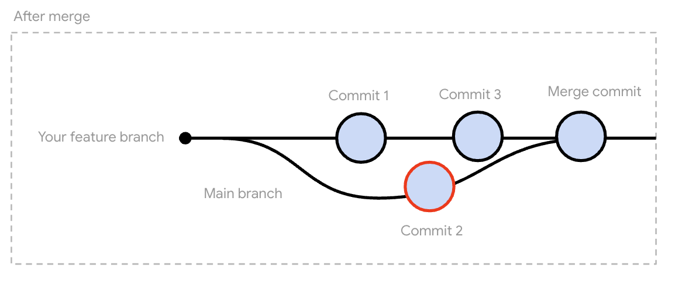
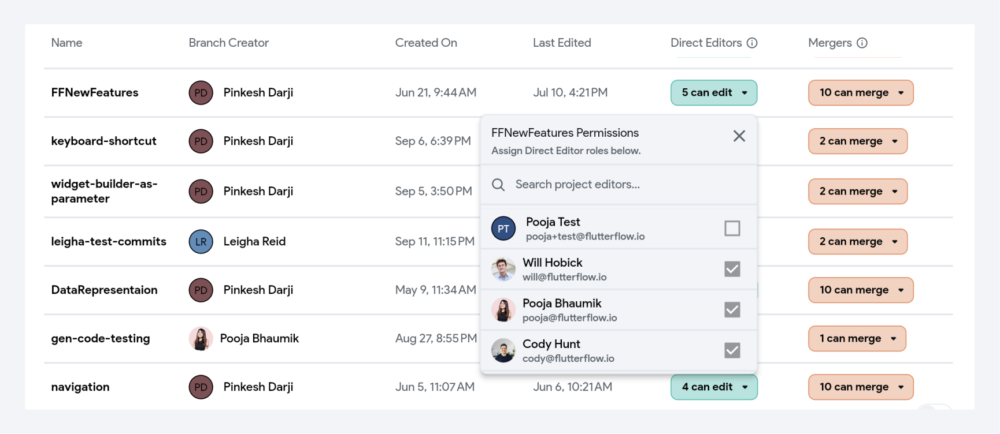

# Branching
Branching creates a separate copy of your work, so you can add new features without disrupting your current progress. It enables multiple developers or teams to work simultaneously on different features without interfering with each other.

Suppose you have an eCommerce app and you want to add a new feature, such as a product recommendation system. Instead of incorporating it directly into your `main` branch and potentially causing problems, you can create a branch to work on this new feature in isolation. Once it's complete, you can integrate it back into the `main` branch.

:::info
This feature is only available for Pro, Teams and Enterprise users.
:::

:::warning

Creating a branch here doesn't create one on GitHub. Branches stay and are managed solely within 
FlutterFlow. You can also learn more about 
[**managing custom code on GitHub**](../exporting-code/push-to-github.md#manage-custom-code-on-github).
:::

## Branching Overview
Before you create and merge a branch, it is essential to understand the general workflow. Here's what it looks like:

First, create a new branch from the `main` branch. After making your changes and finalizing the 
feature, merge this new branch back into the `main` branch. If there are any conflicts, 
you must resolve them first.

## Creating a New Branch
To create a new branch from the current branch, simply go to the **Branching Options** button next to current branch in the **Branching menu.**

    <iframe 
        src="https://demo.arcade.software/5n61rPZR7WuWxs0lTFkE?embed&show_copy_link=true"
        title="Sharing a Project with a User"
        style={{
            position: 'absolute',
            top: 0,
            left: 0,
            width: '100%',
            height: '100%',
            colorScheme: 'light'
        }}
        frameborder="0"
        loading="lazy"
        webkitAllowFullScreen
        mozAllowFullScreen
        allowFullScreen
        allow="clipboard-write">
    </iframe>

:::tip

You can create a new branch from any existing branch, however it's most common to create new branches from `main`

:::

## Commits

A commit is essentially a saved snapshot of your project at a particular point in time. When you make changes to your project (such as adding new widgets, modifying actions, or configuring integrations), you can create a commit to save these changes. Each commit stores a record of what has been modified and serves as a version history for your branch, making it easy to see what has changed and roll back to previous versions if needed.

### Create Commits

To create a commit, follow these steps:

    <iframe 
        src="https://demo.arcade.software/bfqijjODDijWLszOOQqV?embed&show_copy_link=true"
        title=""
        style={{
            position: 'absolute',
            top: 0,
            left: 0,
            width: '100%',
            height: '100%',
            colorScheme: 'light'
        }}
        frameborder="0"
        loading="lazy"
        webkitAllowFullScreen
        mozAllowFullScreen
        allowFullScreen
        allow="clipboard-write">
    </iframe>

:::tip[Best Practices for Commits]
- **Commit Frequently:** Save your work often to ensure that changes are tracked, and you have a detailed version history. You can use the keyboard shortcut (cmd + enter) for faster iteration!
- **Use Clear Messages:** Always provide meaningful commit messages that explain what was done.
- **Test Before Committing:** Ensure that the project works as expected before committing significant changes.
:::

### View Commit Changes

Once the commit is created, you can see the list of all commits under the **Branch History** section. Here, each commit is displayed with a timestamp, the user who made the changes, and a commit message. You can also search and filter through commits by specific users and date range.

To see the commit changes, simply click on the commit.

    <iframe 
        src="https://demo.arcade.software/3WbkSc5kCtZNzQf1DlKQ?embed&show_copy_link=true"
        title="Viewing Commits"
        style={{
            position: 'absolute',
            top: 0,
            left: 0,
            width: '100%',
            height: '100%',
            colorScheme: 'light'
        }}
        frameborder="0"
        loading="lazy"
        webkitAllowFullScreen
        mozAllowFullScreen
        allowFullScreen
        allow="clipboard-write">
    </iframe>

### Commit Options

The options provided for each commit are as follows:

- **View Commit:** This option lets you view the details of a particular commit.
- **Restore Branch to Commit:** This option allows you to revert your branch to a previous commit. It creates a new commit that resets the branch to the state of the selected commit. This is particularly useful if a recent commit introduced issues, and you need to return to a stable point in the project's history.
- **Copy Commit ID:** Every commit is assigned a unique ID. This option allows you to copy the commit ID, which can be useful for referencing specific commits in collaboration with team members.

### Commits vs. Snapshots and Versions
FlutterFlow offers multiple ways to save the state of your project at specific points in time.

- **Snapshots** are automatically created as you edit your project. Think of them as automatic backups that you can revert to whenever needed.
- **Versions and commits**, on the other hand, are manually created checkpoints. While both serve a similar purpose, commits offer more flexibility by allowing you to view the specific changes made in each commit. If you're using a plan that supports branching, it's recommended to use commits for better tracking and version control.

## Merging

Merging allows you to push the changes you've made in one branch into another. For example, you may want to push your changes from a feature branch, or a branch where you are developing a new feature, back into the `main` branch once it's ready to be deployed to your users.

Say your feature branch has two commits: `Commit 1` and `Commit 3` (which are your changes), and `Commit 2` (made by a colleague in the main branch).  The merge would look like the below image:

You can also merge changes from the parent branch, into the current branch. For example, say you want to pull the latest commits on `main` into your feature branch. This merge would look like the below image:

During a merge, FlutterFlow compares the changes made in both branches, if the changes don't overlap or conflict then the branches are automatically combined. If there are conflicts (for example, both branches modified the same widget property) you'll need to resolve these before the merge can be completed.

:::note Few things to note here

- At the moment, FlutterFlow only supports merging into the parent branch, or the branch that the current branch was created from (usually `main`)
- Only the user who initiated the merge can access both the `main` branch and the branch during an ongoing merge.
- Merges result in a merge [commit](#commits), which means you can undo a merge by restoring the branch to a prior commit
- If you leave the project during the merge and come back, the progress you have made on the merge will be preserved.

:::

### Initiating a merge

You can initiate a merge in either direction by selecting the **Branch Options** button next to the current branch in the **Branching Menu.**

    <iframe 
        src="https://demo.arcade.software/VHuZbhTfT8Q8GbaMzMWA?embed&show_copy_link=true"
        title="Initiating a Merge"
        style={{
            position: 'absolute',
            top: 0,
            left: 0,
            width: '100%',
            height: '100%',
            colorScheme: 'light'
        }}
        frameborder="0"
        loading="lazy"
        webkitAllowFullScreen
        mozAllowFullScreen
        allowFullScreen
        allow="clipboard-write">
    </iframe>

Next, you'll see a screen that will display if there are any conflicts. If you don’t have any conflicts, you can simply go ahead and click **Merge Branch**.

### Resolve merge conflicts
A merge conflict occurs when multiple team members make changes to the same part of the project.

For example, imagine two developers, Alice and Bob, are working on the same FlutterFlow project and both decide to update the same button widget.

| **Developer**       | **Branch Name**     | **Changes**                                        |
|---------------------|---------------------|----------------------------------------------------|
| Alice               | `feature-alice`     | - Changes the button text to "Submit Form"         |
|                     |                     | - Changes the button color to blue                 |
| Bob                 | `feature-bob`       | - Changes the button text to "Send"                |
|                     |                     | - Changes the button color to green                |

When Alice's changes are merged into the main project first, her updates will be integrated without any issues. However, when Bob tries to merge his changes afterward, a merge conflict will occur because the changes to the button text and color have already been modified by Alice.

In your project, if you get merge conflicts, here’s how you resolve them.

    <iframe 
        src="https://demo.arcade.software/Ttcvg8zDKtlQSakqppOf?embed&show_copy_link=true"
        title="Resolving Merge Conflicts"
        style={{
            position: 'absolute',
            top: 0,
            left: 0,
            width: '100%',
            height: '100%',
            colorScheme: 'light'
        }}
        frameborder="0"
        loading="lazy"
        webkitAllowFullScreen
        mozAllowFullScreen
        allowFullScreen
        allow="clipboard-write">
    </iframe>

For certain conflicts, such as those involving variables and API configurations, you'll see a **View Configuration** option. Enabling this option opens the split screen view displaying changes from the new branch, allowing you to easily identify what has changed.  In this view, you can see things that were removed highlighted in red, and things that were added highlighted in green.

### Resolve conflicts manually
If you choose to resolve manually, you can directly make changes in the **Accepted Changes** section. Note that if you cancel a manual resolution, you can choose to either keep or discard the changes you have made since starting the manual resolution.

    <iframe 
        src="https://demo.arcade.software/xZsRHG7d5rfNf5z937hZ?embed&show_copy_link=true"
        title="Sharing a Project with a User"
        style={{
            position: 'absolute',
            top: 0,
            left: 0,
            width: '100%',
            height: '100%',
            colorScheme: 'light'
        }}
        frameborder="0"
        loading="lazy"
        webkitAllowFullScreen
        mozAllowFullScreen
        allowFullScreen
        allow="clipboard-write">
    </iframe>

:::info

If the visual editor doesn't display something in the split screen UI that you need to manage during a merge, click the **Edit Project** button and edit the project as usual.

::::

## Branch-level Permissions
In your project, you have the ability to assign specific roles such as **Editors** and **Mergers** to project members for each branch.

To configure these permissions, navigate to **Settings & Integrations > Project Setup > Collaboration > Branch Permissions**.

- **Editors** assigned to a branch have the authority to make direct modifications to the project while working within that branch. 
- **Mergers** on the other hand, are only allowed to merge other branches into that branch. This is especially useful for protected branches where you don't want any users to make direct modifications. Instead, users should only merge other branches into that branch.

